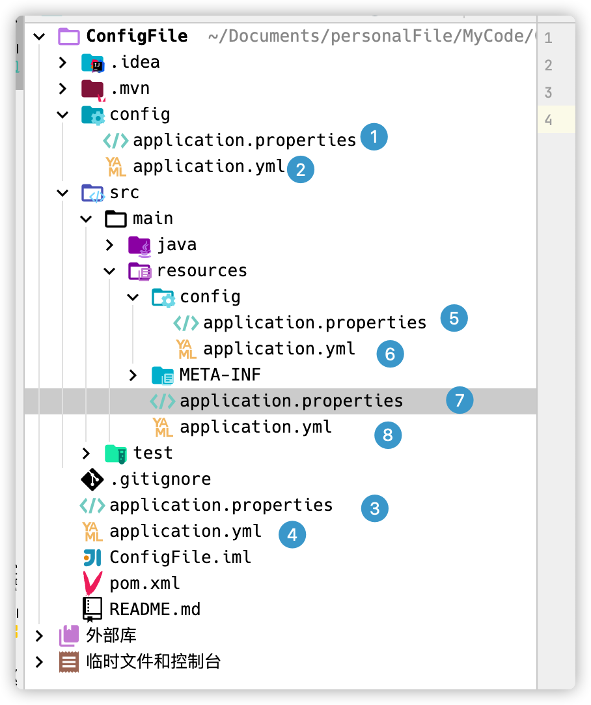
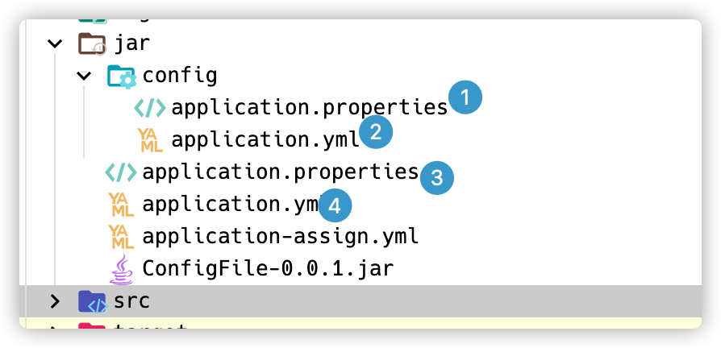

# SpringBoot 配置文件加载

## 1. 项目内配置文件加载顺序

SpringBoot 在启动时会依次扫描以下路径的配置文件作为启动的默认配置文件：

```shell
./config/* 
./*
./src/main/resources/config/*
./src/main/resources/*
```

其中 `.properties` 文件加载优先级高于 `.yml ` 文件



在上述目录分别创建 `application.properties` 和 `application.yml` 执行顺序如上图

**application.properties**

```properties
server.port=9090
spring.application.name=ConfigTest
config.name=config in /config/application.properties
```

**application.yml**

```yaml
server:
  port: 9090
spring:
  application:
    name: ConfigTest
config:
  name: config in /config
```

**加载顺序**

```shell
./config/application.properties # 1
./config/application.yml # 2
./application.properties # 3
./application.yml # 4
./src/main/resources/config/application.properties # 5
./src/main/resources/config/application.yml # 6
./src/main/resources/application.properties # 7
./src/main/resources/application.yml # 8
```

## 2.将项目打包后对配置文件的加载

通过 maven 对 spring 项目进行打包后，jar 包在启动时会依次扫描 jar 包所在路径的以下目录进行读取配置文件，也可以在执行时进行指定配置文件进行执行

```shell
./config/* 
./*
```

配置文件执行顺序如下图



指定配置文件执行：

```shell
java -jar -Dspring.config.location=./application-assign.yml ConfigFile-0.0.1.jar 
```

